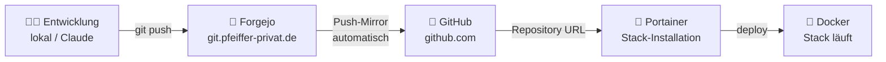
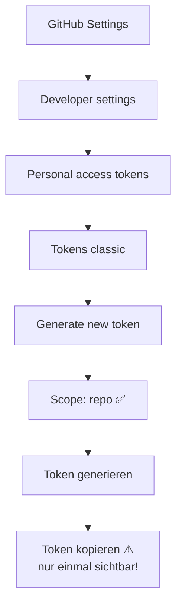
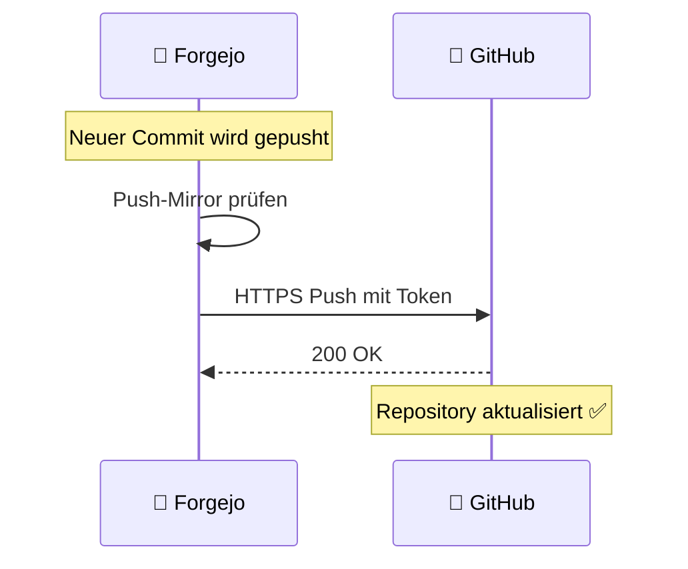
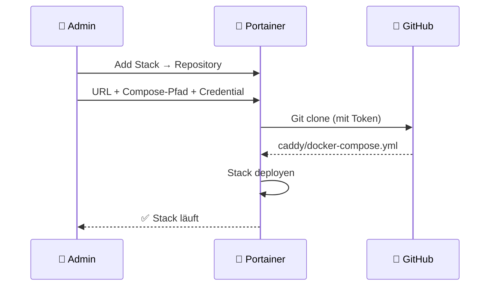
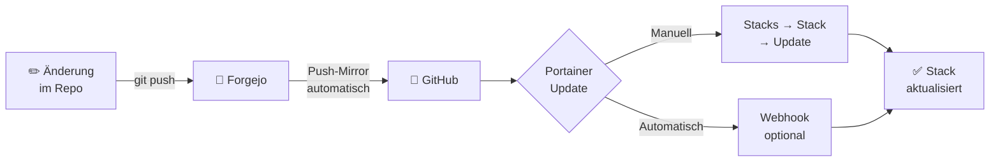

# GitHub Mirror & Stack-Installation via Portainer

> **Ziel:** Forgejo-Repository automatisch zu GitHub spiegeln und Docker-Stacks in Portainer direkt von GitHub installieren.  
> **Beispiel:** Caddy-Stack

---

## Übersicht



---

## Teil 1 – GitHub Repository anlegen

### 1.1 Neues Repository auf GitHub erstellen

```
https://github.com/new

  Repository name:  Infrastruktur
  Visibility:       Private  ← empfohlen (enthält Stack-Strukturen)
  Initialize:       NEIN (kein README, kein .gitignore)

→ Create repository
```

> ⚠️ Das Repository muss **leer** bleiben – Forgejo befüllt es via Mirror.

### 1.2 GitHub Personal Access Token erstellen

```
GitHub → Settings → Developer settings
  → Personal access tokens → Tokens (classic)
  → Generate new token (classic)

  Note:       Forgejo Mirror
  Expiration: No expiration (oder 1 Jahr)
  Scopes:     ✅ repo  (alle Unteroptionen)

→ Generate token
→ Token kopieren und sicher speichern!
```



---

## Teil 2 – Push-Mirror in Forgejo einrichten

### 2.1 Mirror-Einstellungen öffnen

```
https://git.pfeiffer-privat.de/ppfeiffer/Infrastruktur
  → Settings (Zahnrad oben rechts)
  → Repository
  → Mirrors (ganz unten scrollen)
  → Push Mirrors → Add Push Mirror
```

### 2.2 Mirror konfigurieren

```
Remote URL:       https://github.com/DEIN-GITHUB-USERNAME/Infrastruktur.git
Username:         DEIN-GITHUB-USERNAME
Password/Token:   (GitHub Token aus 1.2)
Sync on commit:   ✅ aktivieren  ← sofort bei jedem Push spiegeln

→ Add Push Mirror
```



### 2.3 Mirror testen

```
Forgejo → Infrastruktur → Settings → Mirrors
  → Push Mirrors → Synchronize Now (▶ Button)
```

Danach auf GitHub prüfen: `https://github.com/DEIN-USERNAME/Infrastruktur`  
→ Alle Dateien sollten sichtbar sein.

---

## Teil 3 – Portainer mit GitHub verbinden

### 3.1 GitHub Token in Portainer hinterlegen

```
Portainer → Settings → Credentials → Add credential

  Type:     Git
  Name:     github
  Username: DEIN-GITHUB-USERNAME
  Token:    (GitHub Token aus 1.2)  ← gleicher Token

→ Save credential
```

> 💡 Der gleiche GitHub-Token funktioniert für Mirror (Schreiben) und Portainer (Lesen).

### 3.2 Caddy-Stack in Portainer anlegen

```
Portainer → Stacks → Add Stack → Repository

  Name:               caddy
  Repository URL:     https://github.com/DEIN-USERNAME/Infrastruktur.git
  Repository ref:     refs/heads/main
  Compose path:       caddy/docker-compose.yml
  Authentication:     ✅ aktivieren → Credential "github" auswählen
```



### 3.3 Environment Variables eintragen

Unter **Environment Variables** im selben Formular:

| Variable | Wert |
|----------|------|
| `CADDY_ACME_EMAIL` | `deine@email.de` |
| `CADDY_JWT_SECRET` | *(openssl rand -base64 48)* |
| `CADDYMANAGER_JWT_SECRET` | *(openssl rand -base64 48)* |

```bash
# Secrets lokal generieren:
openssl rand -base64 48  # → CADDY_JWT_SECRET
openssl rand -base64 48  # → CADDYMANAGER_JWT_SECRET
```

### 3.4 Stack deployen

```
→ Deploy the stack
```

Portainer clont das GitHub-Repository, liest `caddy/docker-compose.yml` und startet alle Container.

---

## Teil 4 – Update-Workflow

Wenn Änderungen am Stack vorgenommen werden:



### Manueller Update

```
Portainer → Stacks → caddy → Update the stack
  → ✅ Pull latest image
  → ✅ Re-pull image
  → Update the stack
```

### Automatischer Update via Webhook (optional)

```
Portainer → Stacks → caddy → Stack Webhook
  → Webhook URL kopieren

GitHub → Infrastruktur → Settings → Webhooks → Add webhook
  Payload URL:   (Portainer Webhook URL)
  Content type:  application/json
  Events:        ✅ Just the push event
```

---

## Übersicht: Alle Stacks via GitHub installieren

Gleicher Ablauf für alle Stacks – nur `Compose path` ändert sich:

| Stack | Compose path | Beschreibung |
|-------|-------------|-------------|
| `caddy` | `caddy/docker-compose.yml` | Haupt-Proxy *(zuerst installieren!)* |
| `matrix` | `matrix/docker-compose.yml` | Matrix/Synapse + Element |
| `meshmonitor` | `meshmonitor/docker-compose.yml` | Meshtastic-Überwachung |

---

## Fehlerbehebung

| Problem | Ursache | Lösung |
|---------|---------|--------|
| Mirror schlägt fehl | Token ungültig | GitHub → Token prüfen/erneuern |
| Portainer kann nicht clonen | Repo privat, kein Token | Credential in Portainer prüfen |
| `docker-compose.yml not found` | Falscher Compose-Pfad | Pfad prüfen: `caddy/docker-compose.yml` |
| Stack startet nicht | Env-Variable fehlt | Portainer → Stack → Env prüfen |
| GitHub zeigt alten Stand | Mirror noch nicht synchronisiert | Forgejo → Mirrors → Sync Now |

---

*Letzte Aktualisierung: 2025-05-04 – Claude*
