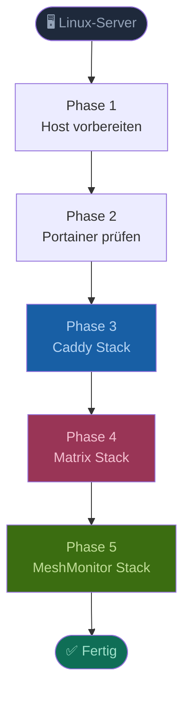
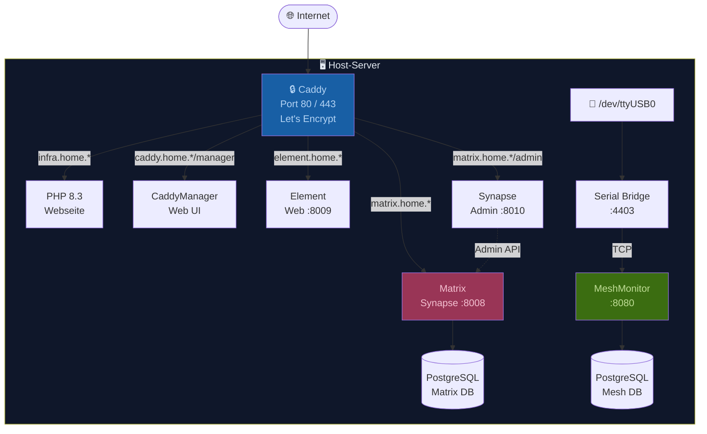
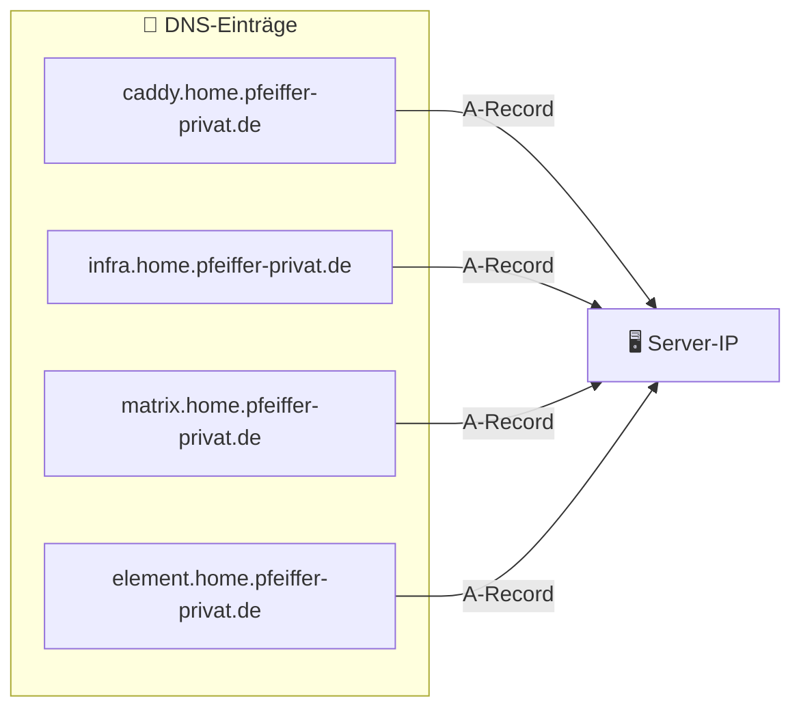
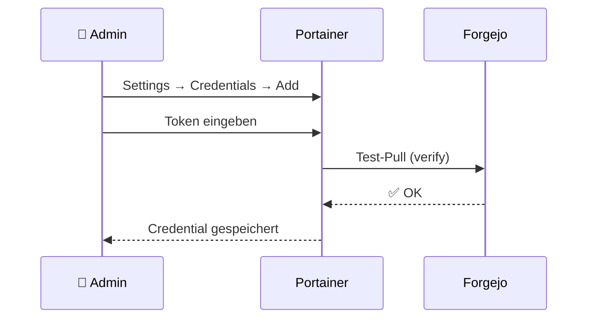
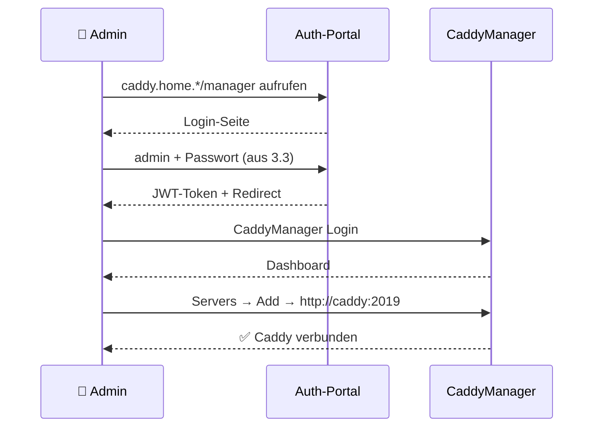
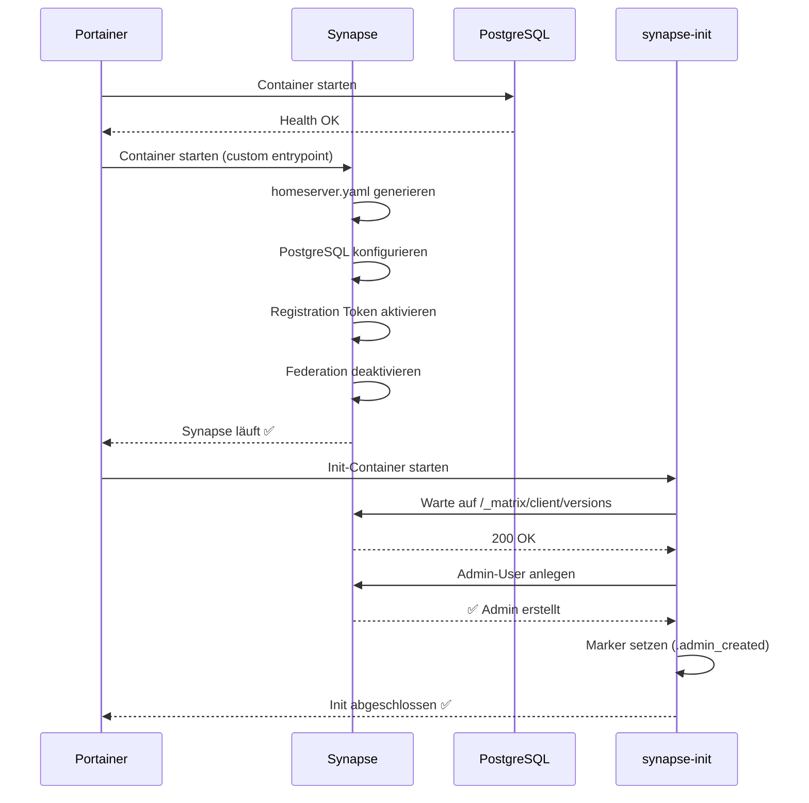
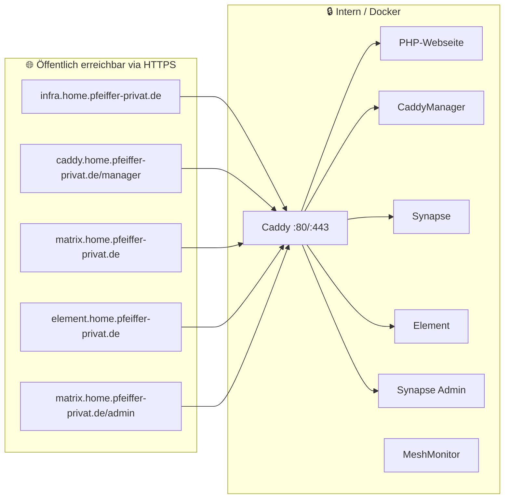

# Installationsanleitung – Infrastruktur

> **Ziel:** Vollständige Einrichtung aller Docker-Stacks auf einem Heimserver  
> **Voraussetzung:** Linux-Server (Ubuntu/Debian empfohlen), Root-Zugang, Portainer CE läuft bereits

---

## Überblick



---

## Architektur



---

## Phase 1 – Host vorbereiten

### 1.1 Docker installieren

```bash
# Paketlisten aktualisieren
apt update && apt upgrade -y

# Docker installieren
apt install -y docker.io docker-compose-plugin curl git

# Docker-Dienst starten und aktivieren
systemctl enable --now docker

# Prüfen ob Docker läuft
docker --version
docker compose version
```

### 1.2 Bestehende Dienste auf Port 80/443 stoppen

> ⚠️ **Wichtig:** Caddy belegt Port 80 und 443 direkt. Alle anderen Dienste auf diesen Ports müssen vorher gestoppt werden.

```bash
# NGinx Proxy Manager stoppen (falls vorhanden)
docker stop nginxproxymanager 2>/dev/null || true

# Prüfen ob Ports frei sind
ss -tlnp | grep -E ':80|:443'
# Ausgabe sollte leer sein
```

### 1.3 DNS-Einträge prüfen

Alle Domains müssen per A-Record auf die Server-IP zeigen:



```bash
# DNS prüfen
dig +short caddy.home.pfeiffer-privat.de
dig +short matrix.home.pfeiffer-privat.de
# Beide müssen die Server-IP zurückgeben
```

---

## Phase 2 – Portainer prüfen

> Portainer CE läuft bereits. Nur den Forgejo-Token hinterlegen.

### 2.1 Forgejo-Token in Portainer hinterlegen

```
Portainer → Settings → Credentials → Add credential
  Type:     Git
  Name:     forgejo
  Username: ppfeiffer
  Token:    (Forgejo Access Token)
```



---

## Phase 3 – Caddy Stack (Haupt-Proxy)

> **Zuerst installieren!** Caddy ist der Reverse-Proxy für alle anderen Dienste.

### 3.1 Secrets generieren

```bash
# JWT Secret für Caddy Security Auth-Portal
openssl rand -base64 48
# → Notieren als CADDY_JWT_SECRET

# JWT Secret für CaddyManager
openssl rand -base64 48
# → Notieren als CADDYMANAGER_JWT_SECRET
```

### 3.2 Stack in Portainer anlegen

```
Portainer → Stacks → Add Stack → Repository

  Name:               caddy
  Repository URL:     https://git.pfeiffer-privat.de/ppfeiffer/Infrastruktur.git
  Repository ref:     refs/heads/main
  Compose path:       caddy/docker-compose.yml
  Authentication:     Credential "forgejo" auswählen
```

**Environment Variables:**

| Variable | Wert |
|----------|------|
| `CADDY_ACME_EMAIL` | deine@email.de |
| `CADDY_JWT_SECRET` | *(generierter Wert aus 3.1)* |
| `CADDYMANAGER_JWT_SECRET` | *(generierter Wert aus 3.1)* |

```
→ Deploy the stack
```

### 3.3 Caddy Security Admin-User anlegen

> Einmaliger Schritt nach dem ersten Deploy:

```bash
docker exec -it caddy caddy security local users add \
  --identity-store localdb \
  --username admin \
  --email admin@pfeiffer-privat.de \
  --password SICHERES_PASSWORT \
  --roles authp/admin
```

### 3.4 CaddyManager einrichten

```
1. https://caddy.home.pfeiffer-privat.de/manager öffnen
2. Login über Caddy Security Auth-Portal (admin + Passwort aus 3.3)
3. CaddyManager Login: admin / caddyrocks
4. ⚠️ Passwort sofort ändern! (User Management → admin → Edit)
5. Servers → Add Server:
     Name: Hauptserver
     URL:  http://caddy:2019
```



### 3.5 Ergebnis prüfen

```bash
# Caddy läuft?
docker ps | grep caddy

# Let's Encrypt Zertifikat vorhanden?
curl -I https://infra.home.pfeiffer-privat.de

# PHP-Webseite erreichbar?
curl -s https://infra.home.pfeiffer-privat.de | grep "pfeiffer"
```

**Erwartetes Ergebnis:**

| URL | Status |
|-----|--------|
| `https://infra.home.pfeiffer-privat.de` | ✅ PHP-Seite |
| `https://caddy.home.pfeiffer-privat.de/manager` | ✅ CaddyManager |

---

## Phase 4 – Matrix Stack

### 4.1 Secrets generieren

```bash
# PostgreSQL Passwort
openssl rand -base64 32
# → Notieren als POSTGRES_PASSWORD

# Admin-Passwort frei wählen
# → Notieren als ADMIN_PASSWORD
```

### 4.2 Stack in Portainer anlegen

```
Portainer → Stacks → Add Stack → Repository

  Name:           matrix
  Repository URL: https://git.pfeiffer-privat.de/ppfeiffer/Infrastruktur.git
  Repository ref: refs/heads/main
  Compose path:   matrix/docker-compose.yml
  Authentication: Credential "forgejo" auswählen
```

**Environment Variables:**

| Variable | Wert |
|----------|------|
| `MATRIX_DOMAIN` | `matrix.home.pfeiffer-privat.de` |
| `POSTGRES_PASSWORD` | *(generierter Wert aus 4.1)* |
| `ADMIN_USERNAME` | `admin` |
| `ADMIN_PASSWORD` | *(gewähltes Passwort aus 4.1)* |

```
→ Deploy the stack
```

### 4.3 Automatischer Initialisierungsablauf



### 4.4 Matrix-Domains in Caddy eintragen

Im CaddyManager → Configurations → Caddyfile bearbeiten und am Ende ergänzen:

```caddyfile
matrix.home.pfeiffer-privat.de {
    reverse_proxy localhost:8008
}

element.home.pfeiffer-privat.de {
    reverse_proxy localhost:8009
}
```

Alternativ direkt im Repo unter `caddy/config/Caddyfile` ergänzen und in Portainer Stack updaten.

### 4.5 Ergebnis prüfen

```bash
# Synapse läuft?
docker logs matrix-synapse | tail -20

# Matrix API erreichbar?
curl https://matrix.home.pfeiffer-privat.de/_matrix/client/versions
```

**Erwartetes Ergebnis:**

| URL | Status |
|-----|--------|
| `https://matrix.home.pfeiffer-privat.de/_matrix/client/versions` | ✅ JSON-Antwort |
| `https://element.home.pfeiffer-privat.de` | ✅ Element Web |
| `https://matrix.home.pfeiffer-privat.de/admin` | ✅ Synapse Admin |

### 4.6 Ersten Registration Token erstellen

```
Synapse Admin UI → https://matrix.home.pfeiffer-privat.de/admin
→ Login: ADMIN_USERNAME / ADMIN_PASSWORD
→ Registration Tokens → Create Token
     Uses allowed: 1
     Token: einladung-max (oder leer lassen für zufälligen Token)
```

---

## Phase 5 – MeshMonitor Stack (optional)

> Nur relevant wenn ein Meshtastic-Node per USB angeschlossen ist.

### 5.1 Voraussetzung prüfen

```bash
# USB-Device vorhanden?
ls -la /dev/ttyUSB0

# Benutzer zur dialout-Gruppe hinzufügen (falls nötig)
usermod -aG dialout $USER
```

### 5.2 Stack in Portainer anlegen

```
Portainer → Stacks → Add Stack → Repository

  Name:           meshmonitor
  Repository URL: https://git.pfeiffer-privat.de/ppfeiffer/Infrastruktur.git
  Repository ref: refs/heads/main
  Compose path:   meshmonitor/docker-compose.yml
  Authentication: Credential "forgejo" auswählen
```

**Environment Variables:**

| Variable | Wert |
|----------|------|
| `SESSION_SECRET` | *(openssl rand -base64 32)* |
| `POSTGRES_USER` | `meshmonitor` |
| `POSTGRES_PASSWORD` | *(openssl rand -base64 24)* |

```
→ Deploy the stack
```

### 5.3 MeshMonitor in Caddy eintragen

```caddyfile
mesh.home.pfeiffer-privat.de {
    reverse_proxy localhost:8080
}
```

---

## Übersicht aller Dienste nach der Installation



---

## Nützliche Befehle

### Stack-Status prüfen

```bash
# Alle laufenden Container
docker ps --format "table {{.Names}}\t{{.Status}}\t{{.Ports}}"

# Logs eines Containers
docker logs -f caddy
docker logs -f matrix-synapse
docker logs -f meshmonitor
```

### Stack updaten (nach Repo-Änderungen)

```
Portainer → Stacks → [Stack auswählen] → Update the stack → Pull and redeploy
```

### Caddy neu laden (nach Caddyfile-Änderung)

```bash
docker exec caddy caddy reload --config /etc/caddy/Caddyfile
```

### Matrix Admin-Token abrufen

```
Element → Einstellungen → Hilfe & Info → Zugriffstoken anzeigen
```

---

## Fehlerbehebung

```mermaid
flowchart TD
    E[❌ Problem] --> Q1{Was funktioniert nicht?}

    Q1 -->|Zertifikat fehlt| A1[DNS prüfen\ndig +short domain]
    Q1 -->|Container startet nicht| A2[Logs prüfen\ndocker logs container]
    Q1 -->|Matrix Init schlägt fehl| A3[Init-Log prüfen\ndocker logs matrix-synapse-init]
    Q1 -->|Caddy 502 Bad Gateway| A4[Zieldienst prüfen\ndocker ps]
    Q1 -->|Port bereits belegt| A5[Prozess finden\nss -tlnp | grep :80]

    A1 --> R[✅ Behoben]
    A2 --> R
    A3 --> R
    A4 --> R
    A5 --> R
```

| Problem | Lösung |
|---------|--------|
| `port is already allocated` | `docker ps` → alten Container stoppen |
| `certificate not found` | DNS-Eintrag prüfen, Caddy-Logs prüfen |
| Matrix Init hängt | `docker logs matrix-synapse-init -f` |
| 502 Bad Gateway | Zieldienst läuft? `docker ps` |
| Portainer kann nicht clonen | Forgejo-Token unter Credentials prüfen |

---

*Letzte Aktualisierung: 2025-05-04 – Claude*
