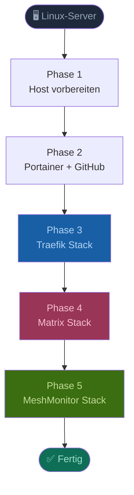
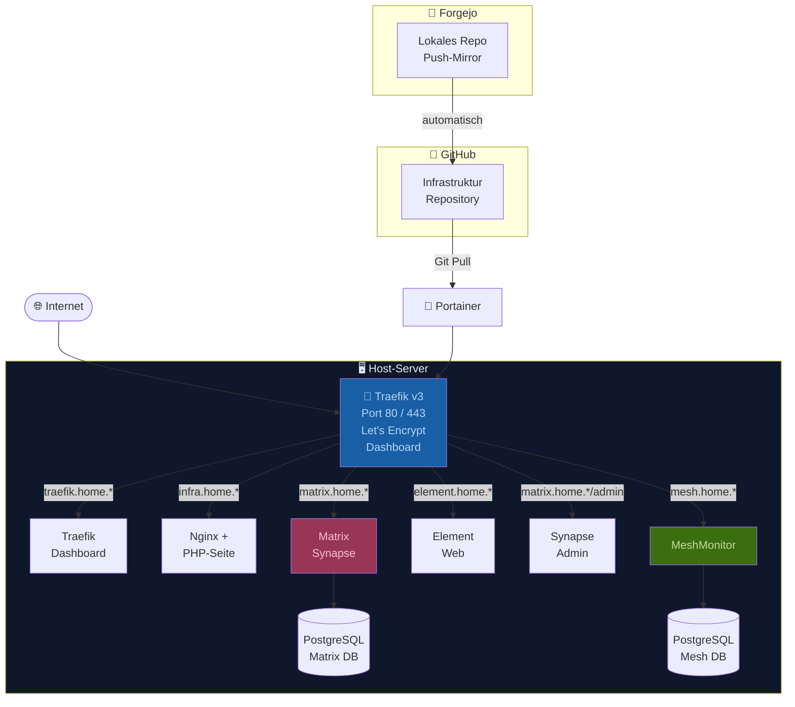
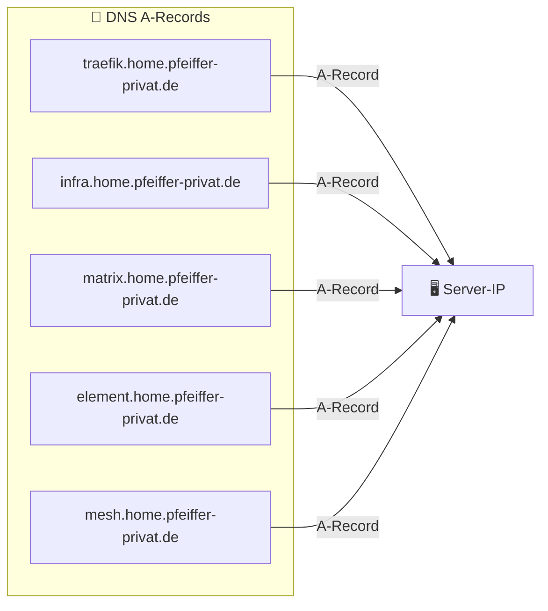
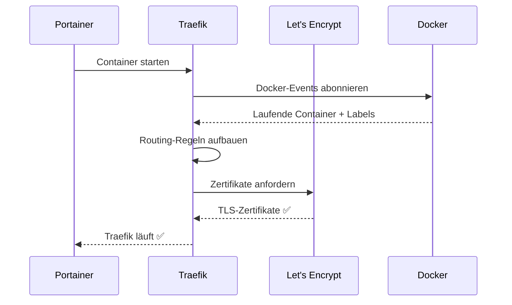
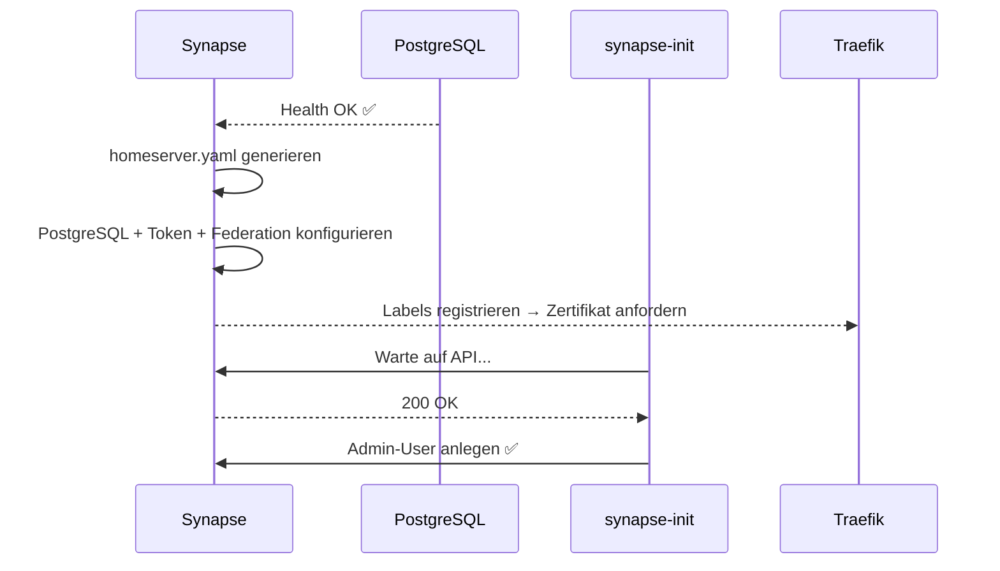
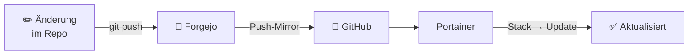
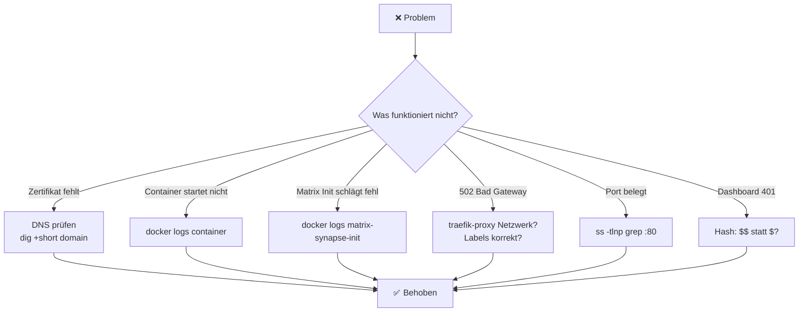

# Installationsanleitung – Infrastruktur

> **Ziel:** Vollständige Einrichtung aller Docker-Stacks auf einem Heimserver  
> **Voraussetzung:** Linux-Server (Ubuntu/Debian empfohlen), Root-Zugang, Portainer CE läuft bereits

---

## Überblick



---

## Architektur



---

## Phase 1 – Host vorbereiten

### 1.1 Docker installieren

```bash
apt update && apt upgrade -y
apt install -y docker.io docker-compose-plugin curl git apache2-utils
systemctl enable --now docker
docker --version && docker compose version
```

### 1.2 Port 80 und 443 freigeben

> ⚠️ Traefik belegt Port 80 und 443 direkt. Andere Dienste auf diesen Ports vorher stoppen.

```bash
# NGinx Proxy Manager stoppen (falls vorhanden)
docker stop nginxproxymanager 2>/dev/null || true

# Ports müssen frei sein (Ausgabe muss leer sein)
ss -tlnp | grep -E ':80|:443'
```

### 1.3 DNS-Einträge prüfen



```bash
dig +short traefik.home.pfeiffer-privat.de
dig +short matrix.home.pfeiffer-privat.de
```

### 1.4 Basic Auth Hash für Traefik-Dashboard generieren

```bash
# $ muss als $$ escaped werden – Pflicht für docker-compose!
echo $(htpasswd -nb admin DEIN_PASSWORT) | sed -e 's/\$/\$\$/g'

# Beispielausgabe:
# admin:$$apr1$$ruca84Hq$$mbjdMZBAG.KWn7vfN/SNK/
```

> 📋 Ausgabe kopieren – wird als `TRAEFIK_DASHBOARD_AUTH` in Portainer eingetragen.

---

## Phase 2 – Portainer + GitHub vorbereiten

### 2.1 GitHub Token in Portainer hinterlegen

```
Portainer → Settings → Credentials → Add credential
  Type:     Git
  Name:     github
  Username: DEIN-GITHUB-USERNAME
  Token:    (GitHub Personal Access Token)
```

> Noch kein GitHub Token oder Mirror? Siehe [GITHUB_MIRROR_UND_PORTAINER.md](./GITHUB_MIRROR_UND_PORTAINER.md)

---

## Phase 3 – Traefik Stack (zuerst installieren!)

> Traefik muss als erstes laufen – alle anderen Stacks registrieren sich bei Traefik.

### 3.1 Stack in Portainer anlegen

```
Portainer → Stacks → Add Stack → Repository

  Name:           traefik
  Repository URL: https://github.com/DEIN-USERNAME/Infrastruktur.git
  Repository ref: refs/heads/main
  Compose path:   traefik/docker-compose.yml
  Authentication: Credential "github" auswählen
```

### 3.2 Environment Variables

| Variable | Wert | Beschreibung |
|----------|------|-------------|
| `TRAEFIK_ACME_EMAIL` | `deine@email.de` | E-Mail für Let's Encrypt |
| `TRAEFIK_DASHBOARD_AUTH` | *(Hash aus Phase 1.4)* | Basic Auth für Dashboard |

```
→ Deploy the stack
```

### 3.3 Traefik-Ablauf beim Start



### 3.4 Ergebnis prüfen

| URL | Erwartetes Ergebnis |
|-----|-------------------|
| `https://traefik.home.pfeiffer-privat.de` | ✅ Dashboard (Login-Dialog) |
| `https://infra.home.pfeiffer-privat.de` | ✅ PHP-Startseite |

---

## Phase 4 – Matrix Stack

### 4.1 Secrets generieren

```bash
openssl rand -base64 32  # → POSTGRES_PASSWORD
```

### 4.2 Stack in Portainer anlegen

```
Portainer → Stacks → Add Stack → Repository

  Name:           matrix
  Repository URL: https://github.com/DEIN-USERNAME/Infrastruktur.git
  Repository ref: refs/heads/main
  Compose path:   matrix/docker-compose.yml
  Authentication: Credential "github" auswählen
```

### 4.3 Environment Variables

| Variable | Wert |
|----------|------|
| `MATRIX_DOMAIN` | `matrix.home.pfeiffer-privat.de` |
| `POSTGRES_PASSWORD` | *(openssl rand -base64 32)* |
| `ADMIN_USERNAME` | `admin` |
| `ADMIN_PASSWORD` | *(sicheres Passwort)* |

```
→ Deploy the stack
```

### 4.4 Automatischer Initialisierungsablauf



### 4.5 Ergebnis prüfen

| URL | Erwartetes Ergebnis |
|-----|-------------------|
| `https://matrix.home.pfeiffer-privat.de/_matrix/client/versions` | ✅ JSON |
| `https://element.home.pfeiffer-privat.de` | ✅ Element Web |
| `https://matrix.home.pfeiffer-privat.de/admin` | ✅ Synapse Admin |

---

## Phase 5 – MeshMonitor Stack (optional)

### 5.1 Voraussetzung prüfen

```bash
ls -la /dev/ttyUSB0          # USB-Device vorhanden?
usermod -aG dialout $USER    # Benutzer zur dialout-Gruppe
```

### 5.2 Stack in Portainer anlegen

```
Compose path: meshmonitor/docker-compose.yml
```

### 5.3 Environment Variables

| Variable | Wert |
|----------|------|
| `SESSION_SECRET` | *(openssl rand -base64 32)* |
| `POSTGRES_USER` | `meshmonitor` |
| `POSTGRES_PASSWORD` | *(openssl rand -base64 24)* |

---

## Neuen Dienst hinzufügen (Traefik-Labels)

```yaml
services:
  mein-dienst:
    image: mein-image
    networks:
      - traefik-proxy
    labels:
      - "traefik.enable=true"
      - "traefik.http.routers.mein-dienst.rule=Host(`mein-dienst.home.pfeiffer-privat.de`)"
      - "traefik.http.routers.mein-dienst.entrypoints=websecure"
      - "traefik.http.routers.mein-dienst.tls.certresolver=letsencrypt"
      - "traefik.http.services.mein-dienst.loadbalancer.server.port=PORT"
      - "traefik.docker.network=traefik-proxy"

networks:
  traefik-proxy:
    external: true
```

Traefik erkennt den Container **automatisch** – kein Neustart nötig, Zertifikat wird sofort geholt.

---

## Update-Workflow



```
Portainer → Stacks → [Stack] → Update the stack → Pull and redeploy
```

---

## Nützliche Befehle

```bash
# Alle laufenden Container
docker ps --format "table {{.Names}}\t{{.Status}}\t{{.Ports}}"

# Traefik-Routen anzeigen
curl http://localhost:8080/api/http/routers | python3 -m json.tool

# Traefik-Netzwerk prüfen
docker network inspect traefik-proxy

# Logs
docker logs -f traefik
docker logs -f matrix-synapse
docker logs -f meshmonitor
```

---

## Fehlerbehebung



| Problem | Lösung |
|---------|--------|
| `port is already allocated` | `docker ps` → alten Container stoppen |
| Zertifikat fehlt | DNS prüfen, `docker logs traefik` |
| 502 Bad Gateway | Container im `traefik-proxy` Netzwerk? Labels vorhanden? |
| Dashboard zeigt 401 | `$$` im Hash prüfen – `$` muss als `$$` escaped sein |
| Matrix Init hängt | `docker logs matrix-synapse-init -f` |
| Portainer kann nicht clonen | GitHub-Token unter Credentials prüfen |

---

*Letzte Aktualisierung: 2025-05-07 – Claude*
