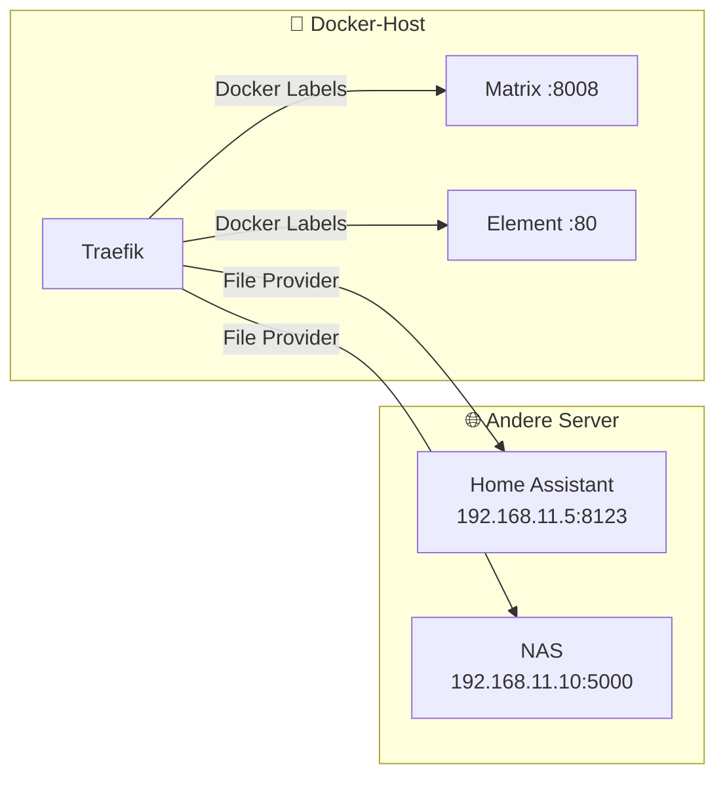

# Traefik File Provider – Einstellungen erklärt

Der File Provider ermöglicht es, Dienste die **nicht auf dem Docker-Host laufen**  
(z.B. Home Assistant auf einem anderen Server) über Traefik erreichbar zu machen.

---

## Warum File Provider?



| Dienst-Typ | Methode |
|------------|---------|
| Läuft auf dem Docker-Host | Docker Labels im Stack |
| Läuft auf einem anderen Server/IP | File Provider (`external-services.yml`) |

---

## Aktivierung im docker-compose.yml

```yaml
command:
  - --providers.file.directory=/config   # Ordner der überwacht wird
  - --providers.file.watch=true          # Hot-reload bei Änderungen
```

```yaml
volumes:
  - traefik-config-dynamic:/config       # Volume wird als /config eingebunden
```

Traefik liest **alle `.yml`-Dateien** im `/config`-Ordner.  
Man kann beliebig viele Dateien anlegen – z.B. eine pro Thema:

```
/config/
├── external-services.yml   ← Home Assistant, NAS, etc.
├── middlewares.yml         ← Gemeinsame Middlewares
└── tls-options.yml         ← TLS-Einstellungen
```

---

## Aufbau von `external-services.yml`

```yaml
http:           # Protokoll – immer "http" auch für HTTPS-Verbindungen
  routers:      # Eingehende Anfragen → welcher Dienst?
    ...
  services:     # Zieldienste → wohin wird weitergeleitet?
    ...
```

Die Datei hat zwei Hauptbereiche: **routers** (was kommt rein) und **services** (wohin geht es).

---

## Routers – Eingehende Anfragen

```yaml
http:
  routers:
    homeassistant:                          # (1) Eindeutiger Name des Routers
      rule: "Host(`home.pfeiffer-privat.de`)"  # (2) Welche Domain?
      entryPoints:                          # (3) Über welchen Port?
        - websecure
      service: homeassistant-svc           # (4) Welcher Service dahinter?
      tls:                                  # (5) TLS/HTTPS aktivieren
        certResolver: letsencrypt
```

### (1) Router-Name

```yaml
homeassistant:
```
Eindeutiger interner Name – darf keine Sonderzeichen oder Leerzeichen enthalten.  
Wird im Traefik-Dashboard als Router-Bezeichnung angezeigt.  
Muss sich von allen anderen Router-Namen unterscheiden (Docker Labels + File Provider).

---

### (2) Rule – Routing-Regel

```yaml
rule: "Host(`home.pfeiffer-privat.de`)"
```
Bestimmt **wann** dieser Router greift.

Häufige Regeln:

| Regel | Bedeutung |
|-------|-----------|
| `Host(`domain.de`)` | Genau diese Domain |
| `Host(`a.de`) \|\| Host(`b.de`)` | Domain A oder B |
| `Host(`domain.de`) && PathPrefix(`/api`)` | Domain + Pfad beginnt mit /api |
| `PathPrefix(`/admin`)` | Alle Pfade die mit /admin beginnen |
| `Host(`domain.de`) && Method(`GET`)` | Nur GET-Anfragen |

---

### (3) EntryPoints – Eingangsport

```yaml
entryPoints:
  - websecure
```
Gibt an über welchen Traefik-Entrypoint die Anfragen ankommen.

| Entrypoint | Port | Protokoll |
|------------|------|-----------|
| `web` | 80 | HTTP (wird zu HTTPS weitergeleitet) |
| `websecure` | 443 | HTTPS ← fast immer dieser |

---

### (4) Service – Zieldienst

```yaml
service: homeassistant-svc
```
Verweist auf einen Service-Eintrag weiter unten in der Datei.  
Konvention: Router-Name + `-svc` als Service-Name.

---

### (5) TLS – HTTPS & Zertifikat

```yaml
tls:
  certResolver: letsencrypt
```
Traefik fordert automatisch ein Let's Encrypt Zertifikat für die Domain an.  
`letsencrypt` ist der Name des Certificate Resolvers aus dem docker-compose.yml.

**Ohne TLS-Block** → kein HTTPS, Verbindung läuft über HTTP.  
**Mit TLS-Block** → automatisch HTTPS mit gültigem Zertifikat.

---

## Services – Zieldienste

```yaml
http:
  services:
    homeassistant-svc:              # (1) Service-Name (muss mit Router übereinstimmen)
      loadBalancer:                 # (2) Load Balancer (auch für einzelne Server)
        servers:
          - url: "http://192.168.11.5:8123"  # (3) Ziel-URL
        passHostHeader: true        # (4) Original-Domain weiterleiten
```

### (1) Service-Name

```yaml
homeassistant-svc:
```
Muss exakt mit dem `service:`-Feld im Router übereinstimmen.

---

### (2) loadBalancer

```yaml
loadBalancer:
```
Traefik nutzt immer einen Load Balancer – auch wenn es nur einen Server gibt.  
Ermöglicht später mehrere Server hinzuzufügen (Hochverfügbarkeit).

Mehrere Server (optional):
```yaml
loadBalancer:
  servers:
    - url: "http://192.168.11.5:8123"
    - url: "http://192.168.11.6:8123"  # Fallback-Server
```

---

### (3) URL – Zieladresse

```yaml
servers:
  - url: "http://192.168.11.5:8123"
```

| Teil | Bedeutung |
|------|-----------|
| `http://` | Verbindung zum Zielserver ist HTTP (Traefik terminiert TLS) |
| `192.168.11.5` | IP-Adresse des Zielservers |
| `:8123` | Port auf dem Zielserver |

> ⚠️ Die Verbindung **Traefik → Zielserver** ist HTTP (unverschlüsselt im internen Netz).  
> Die Verbindung **Browser → Traefik** ist HTTPS. Das ist das normale und sichere Setup.

Falls der Zielserver selbst HTTPS spricht:
```yaml
- url: "https://192.168.11.5:8123"
```

---

### (4) passHostHeader

```yaml
passHostHeader: true
```
Leitet den originalen `Host`-Header weiter an den Zielserver.

| Wert | Bedeutung |
|------|-----------|
| `true` | Zielserver sieht `Host: home.pfeiffer-privat.de` |
| `false` | Zielserver sieht `Host: 192.168.11.5:8123` |

**Für Home Assistant muss `true` gesetzt sein** – HA prüft den Host-Header  
aus Sicherheitsgründen und würde sonst die Verbindung ablehnen.

---

## Weiteren externen Dienst hinzufügen

Einfach Router + Service ergänzen:

```yaml
http:
  routers:
    homeassistant:
      rule: "Host(`home.pfeiffer-privat.de`)"
      entryPoints: [websecure]
      service: homeassistant-svc
      tls:
        certResolver: letsencrypt

    # Neuer Dienst: NAS
    nas:
      rule: "Host(`nas.home.pfeiffer-privat.de`)"
      entryPoints: [websecure]
      service: nas-svc
      tls:
        certResolver: letsencrypt

    # Neuer Dienst: Proxmox
    proxmox:
      rule: "Host(`proxmox.home.pfeiffer-privat.de`)"
      entryPoints: [websecure]
      service: proxmox-svc
      tls:
        certResolver: letsencrypt

  services:
    homeassistant-svc:
      loadBalancer:
        servers:
          - url: "http://192.168.11.5:8123"
        passHostHeader: true

    nas-svc:
      loadBalancer:
        servers:
          - url: "http://192.168.11.10:5000"
        passHostHeader: true

    proxmox-svc:
      loadBalancer:
        servers:
          - url: "https://192.168.11.20:8006"   # Proxmox spricht HTTPS
        passHostHeader: true
```

Nach dem Speichern erkennt Traefik die Änderung **sofort** (hot-reload) –  
kein Neustart des Traefik-Containers nötig.

---

## Konfiguration im laufenden Betrieb bearbeiten

Da die Datei in einem Docker Volume liegt, gibt es zwei Wege:

### Weg 1 – Direkt auf dem Host

```bash
# Volume-Pfad finden
docker inspect traefik | grep -A5 "traefik-config-dynamic"

# Datei bearbeiten
nano /var/lib/docker/volumes/caddy_traefik-config-dynamic/_data/external-services.yml

# Traefik lädt automatisch neu – kein Neustart nötig
```

### Weg 2 – Über den Container

```bash
docker exec -it traefik cat /config/external-services.yml  # Anzeigen
docker cp external-services.yml traefik:/config/           # Datei kopieren
```

### Weg 3 – Repo + Portainer Update (empfohlen)

```
1. external-services.yml im Repo bearbeiten
2. git commit + git push → Forgejo → GitHub
3. Portainer → Stacks → traefik → Update the stack
```

> 💡 Weg 3 ist am saubersten – alle Änderungen sind versioniert und nachvollziehbar.

---

## Häufige Fehler

| Fehler | Ursache | Lösung |
|--------|---------|--------|
| 404 – Router nicht gefunden | YAML-Einrückung falsch | Einrückung mit Spaces prüfen (kein Tab!) |
| 502 – Bad Gateway | IP/Port nicht erreichbar | `ping 192.168.11.5` und Port prüfen |
| Zertifikat fehlt | Domain zeigt nicht auf Server | DNS A-Record prüfen |
| HA lehnt Verbindung ab | `passHostHeader: false` | Auf `true` setzen |
| Traefik lädt Datei nicht | Dateiendung falsch | Muss `.yml` sein, nicht `.yaml` |

---

*Letzte Aktualisierung: 2025-05-07 – Claude*
